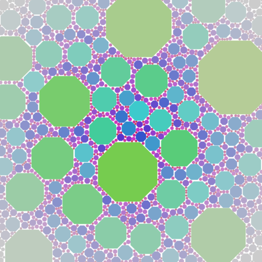

# Hue as function of size

I made another image.
This time only a single shape is used (octagon) and no rotation of the shape.
I made hue a function of size, and kept colour value fixed. 
The saturation drops off from the centre, which so far is my favourite mapping of saturation. 
I think this is because it allows you to focus the view of the beholder.
Maybe I should experiment by moving this 'hue' focus away from centre-image?
I use a c=1.284 packing value.

# Performance

On a side note: I think I know why my spatial indexing optimization did not help much with performance.
This is because a typical overlap test will fail pretty early.
Only the last test (where no overlaps are found) will exhaust all currently placed shapes.
Because the placed shapes are traversed from large to small, the overlap is typically detected very early in the sequence.
I've decided to keep the optimization though.
The code is more complex, but it is faster than not using spatial indexing.

