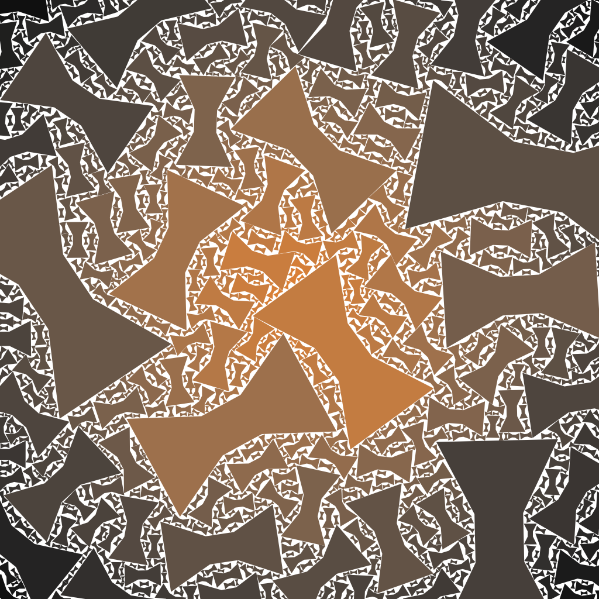

# Bow Ties

I added another shape, here is a tiling of orange bow ties, with c=1.3 and fixed hue.

# All shapes

Here is a tiling of all the shapes, with hue as a function of distance to centre, c=1.31.

I think this project is pretty much coming to a close.
Future work would make the final composition tilable in itself so that top/bottom edges will line up, as would left/right edges.
But I will leave that for now.

